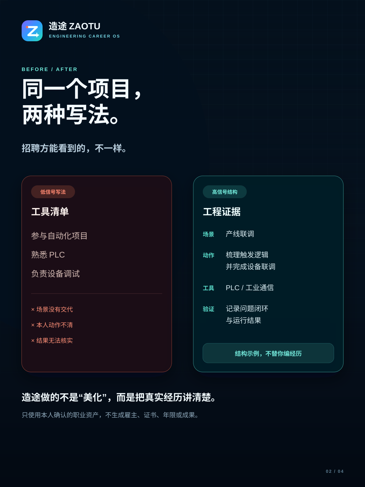

# 造途 ZAOTU

面向工程技术求职者的岗位专属材料与求职决策工具。

造途帮助你把真实工作、项目、实训和作品整理为可核对的职业资产，再结合一条具体 JD，生成匹配依据、能力缺口、HR / 技术主管双视角预审、ATS 文本和可编辑 Word 简历。

[立即体验造途匿名封测版](https://zaotu-beta-d6gya28z138ad2bfe-1459334972.tcloudbaseapp.com/#beta)



## 适合谁

- 自动化、PLC、电气、机器视觉、工业软件与嵌入式方向求职者；
- 设备测试、质量验证、机械设计和电力能源方向求职者；
- 有真实工作、项目、课程设计或实训，但不知道怎样对齐 JD 的学生和 1—5 年从业者。

## 当前能力

- 职业资产：把经历拆成背景、本人动作、工具、交付物与验证结果；
- 简历导入：DOCX 和带文字层的 PDF 只在浏览器本地解析，导入后默认待本人确认；
- JD 匹配：从已确认资产中选择证据，显示直接匹配、相邻能力和待确认缺口；
- 双视角预审：分别从 HR 可读性和技术主管可追问性检查材料；
- 投递材料：生成 ATS 文本、岗位招呼语和可编辑 DOCX；
- 求职工作台：保存职位、材料版本、投递状态、跟进和复盘；
- 匿名反馈：反馈包不包含职业资料、联系方式、JD 或简历正文。

## 隐私边界

职业资料、JD、岗位记录和反馈默认保存在当前浏览器。上传旧简历时，DOCX / 文字型 PDF 在浏览器本地解析；只有用户主动生成正式 Word 时，本次所需资料才通过 HTTPS 发送到匿名文档接口，在内存中处理后返回 DOCX。当前封测版不建立账户，不进行数据库同步或长期保存。

为判断封测漏斗是否顺畅，产品只记录内容盲的匿名进度事件（进入页、启动封测、首条确认资产、提交 JD、生成材料、DOCX 成功、导出反馈包）。每条事件只含事件名、版本和当前标签页随机编号，不包含职业资料、JD、联系方式、文件名或反馈正文；事件失败不会影响使用。

请不要填写身份证号、精确住址、客户机密、未脱敏的现场参数或其他非必要敏感信息。更多说明见 [PRIVACY.md](PRIVACY.md)。

## 岗位母版 JD

[`docs/岗位母版JD/`](docs/岗位母版JD/) 提供五份公开测试资料：

1. 机器视觉开发工程师；
2. 工业上位机工程师；
3. 工业视觉算法工程师；
4. 自动化设备测试工程师；
5. 电气自动化工程师。

这些文件是综合多类岗位能力要求形成的方向母版，不是任何一家企业正在招聘的原文，也不能冒充真实职位。测试造途时可以直接复制其中一份；真正投递时仍应使用目标公司的原始 JD。

## 本地运行

前端：

```bash
cd frontend
npm ci
npm run dev
```

匿名文档 API：

```bash
python -m venv .venv
python -m pip install -e ".[dev]"
python deployment/zaotu-function/main.py
```

测试：

```bash
python -m pytest -q
python scripts/public_scan.py
cd frontend
npm run lint
npm run build
```

## 公开范围

本仓库仅包含造途匿名公开产品所需的白名单源码、虚构演示资料、封测说明和岗位母版。它不包含个人工作台、私人履历、真实用户资料、数据库、导出简历、认证状态、云端密钥、内部协作指令、开发日志、验收记录或私人仓库历史。

当前版本是免费匿名封测版，不代投、不自动登录招聘网站、不虚构经历，也不承诺 offer。

## 反馈

最有价值的反馈不是“看起来不错”，而是你在哪一步无法继续、哪段材料不可信、哪个岗位方向选材不准确。可以通过封测中心导出匿名反馈包，也可以使用仓库的结构化 Issue 模板提交脱敏后的复现步骤。请勿上传完整简历、完整 JD、联系方式或未打码截图。

## 许可证

MIT，详见 [LICENSE](LICENSE)。本项目包含由原 GetJobs 项目演进而来的代码，因此依法保留原贡献者署名；岗位母版中的外部参考链接仍归各自网站所有，母版只用于产品测试与能力结构研究。
